# FinPilot Multi-Agent Financial Planning System - Design Document

## Overview

The FinPilot VP-MAS (Verifiable Planning Multi-Agent System) is designed as a sophisticated financial planning platform that addresses the three critical failure modes of current LLM systems: long-horizon planning failures, execution compounding errors, and hallucination in high-stakes contexts. The system leverages a hierarchical multi-agent architecture with specialized roles, real-time market integration, transparent decision visualization, and advanced adaptive capabilities.

The enhanced system incorporates advanced features including:
- **Sophisticated CMVL (Continuous Monitoring and Verification Loop)** with predictive capabilities
- **Advanced Thought of Search (ToS) algorithms** for multi-path planning optimization
- **Comprehensive ReasonGraph visualization** with interactive exploration
- **Production-ready compliance** including regulatory and tax optimization
- **4-person parallel development architecture** with clear ownership and integration patterns
- **Advanced market intelligence** with scenario simulation and predictive analytics

## Architecture

### Enhanced System Architecture Diagram

```mermaid
graph TB
    subgraph "Frontend Layer - Person D"
        UI[React Frontend]
        VIZ[Advanced ReasonGraph Visualization]
        DASH[Real-time Dashboard & Metrics]
        DEMO[Interactive Live Demo Interface]
        CMVL_UI[CMVL Trigger Panel]
        COMPARE[Plan Comparison Visualization]
    end
    
    subgraph "VP-MAS Core - Distributed Development"
        subgraph "Person A - Orchestration & Architecture"
            OA[Enhanced Orchestration Agent]
            EA[Execution Agent]
            WF[Workflow Engine]
            COMM[Communication Framework]
        end
        
        subgraph "Person B - Information & Intelligence"
            IRA[Advanced Information Retrieval Agent]
            MARKET_MON[Market Monitoring System]
            TRIGGER_DET[Trigger Detection Engine]
            CACHE[Intelligent Caching Layer]
        end
        
        subgraph "Person C - Planning & Reasoning"
            PA[Enhanced Planning Agent]
            GSM[Guided Search Module]
            TOS[Thought of Search Engine]
            OPTIM[Multi-Path Optimizer]
        end
        
        subgraph "Person D - Verification & Visualization"
            VA[Advanced Verification Agent]
            CMVL[Continuous Monitoring & Verification Loop]
            COMPLIANCE[Regulatory Compliance Engine]
            REASON_TRACE[Reasoning Trace Generator]
        end
    end
    
    subgraph "External Systems & APIs"
        MARKET_APIS[Multiple Market Data APIs]
        REG_APIS[Regulatory Data Sources]
        DB[(Enhanced Financial Database)]
        LOGS[(Comprehensive Execution Logs)]
        CACHE_DB[(Redis Cache)]
        MONITOR[(Monitoring & Analytics)]
    end
    
    subgraph "Advanced Features"
        PREDICT[Predictive Analytics]
        ML[Machine Learning Models]
        SECURITY[Security & Compliance]
        AUDIT[Audit Trail System]
    end
    
    UI --> OA
    OA --> WF
    WF --> IRA
    WF --> PA
    WF --> VA
    WF --> EA
    
    IRA --> MARKET_APIS
    IRA --> REG_APIS
    IRA --> CACHE_DB
    MARKET_MON --> TRIGGER_DET
    TRIGGER_DET --> CMVL
    
    PA --> GSM
    GSM --> TOS
    TOS --> OPTIM
    
    VA --> COMPLIANCE
    VA --> CMVL
    CMVL --> REASON_TRACE
    
    EA --> DB
    VA --> LOGS
    VIZ --> LOGS
    VIZ --> REASON_TRACE
    DASH --> DB
    DASH --> MONITOR
    
    PREDICT --> ML
    SECURITY --> AUDIT
    MONITOR --> AUDIT
```



### Enhanced Agent Communication Protocol

The system uses comprehensive structured data contracts with advanced Pydantic BaseModel definitions for all inter-agent communication:

```python
class EnhancedAgentMessage(BaseModel):
    agent_id: str
    message_type: str
    payload: Dict[str, Any]
    timestamp: datetime
    correlation_id: str
    session_id: str
    priority: Literal["critical", "high", "medium", "low"]
    trace_id: str
    performance_metrics: Optional[Dict[str, float]]

class AdvancedPlanningRequest(BaseModel):
    user_goal: str
    current_state: FinancialState
    constraints: List[Constraint]
    trigger_type: Optional[str]
    scenario_context: Optional[Dict[str, Any]]
    risk_profile: RiskProfile
    regulatory_requirements: List[RegulatoryRequirement]
    tax_considerations: TaxContext
    time_horizon: int  # months
    optimization_preferences: OptimizationPreferences

class ComprehensiveVerificationResult(BaseModel):
    plan_id: str
    status: Literal["approved", "rejected", "conditional"]
    violations: List[ConstraintViolation]
    rationale: str
    risk_assessment: RiskAssessment
    compliance_status: ComplianceStatus
    confidence_score: float
    alternative_suggestions: List[AlternativePlan]
    regulatory_notes: List[RegulatoryNote]

class MarketIntelligenceData(BaseModel):
    market_volatility: float
    interest_rates: Dict[str, float]
    sector_trends: Dict[str, float]
    economic_sentiment: float
    regulatory_changes: List[RegulatoryChange]
    event_classification: EventClassification
    severity_assessment: SeverityLevel
    correlation_analysis: Dict[str, float]
    predictive_indicators: Dict[str, float]

class ReasoningTrace(BaseModel):
    trace_id: str
    agent_id: str
    decision_points: List[DecisionPoint]
    explored_paths: List[SearchPath]
    pruned_paths: List[PrunedPath]
    final_decision: str
    rationale: str
    confidence_metrics: Dict[str, float]
    performance_data: PerformanceMetrics
    visualization_data: Dict[str, Any]
```

## Components and Interfaces

### 1. Enhanced Frontend Components (Person D - Verification & Visualization)

Based on the existing codebase and enhanced requirements, the frontend includes:

- **App.tsx**: Main application with enhanced tabbed interface and real-time updates
- **LiveDemoView.tsx**: Advanced interactive CMVL demonstration with scenario simulation
- **ReasonGraphView.tsx**: Sophisticated visualization of planning paths with interactive exploration
- **ReasonGraphLive.tsx**: Real-time execution tracing with predictive path highlighting
- **DashboardView.tsx**: Comprehensive financial metrics and portfolio visualization with analytics
- **ArchitectureView.tsx**: Dynamic system architecture display with performance monitoring
- **CMVLTriggerPanel.tsx**: Advanced trigger simulation interface with complex scenario support
- **FinancialPlanComparison.tsx**: Detailed before/after plan comparison with impact analysis
- **ComplianceMonitor.tsx**: Real-time regulatory compliance monitoring dashboard
- **PerformanceAnalytics.tsx**: System performance and user satisfaction analytics
- **InteractiveReasonExplorer.tsx**: Deep-dive reasoning exploration with filtering and search

### 2. Enhanced Backend Agent System (4-Person Development Architecture)

#### Person A - Enhanced Orchestration Agent (OA) & Core Architecture
```python
class EnhancedOrchestrationAgent:
    def __init__(self):
        self.agents = {}
        self.cmvl_monitor = AdvancedCMVLMonitor()
        self.workflow_engine = EnhancedWorkflowEngine()
        self.communication_framework = CommunicationFramework()
        self.session_manager = SessionManager()
        self.circuit_breakers = CircuitBreakerManager()
        self.performance_monitor = PerformanceMonitor()
    
    async def process_complex_user_goal(self, goal: str, context: Dict[str, Any]) -> AdvancedPlanningResponse:
        # Parse complex multi-constraint natural language goals
        # Coordinate sophisticated agent workflows with priority handling
        # Monitor for complex triggers and manage workflow state
        # Handle session management and correlation tracking
        pass
    
    async def handle_complex_trigger(self, trigger: ComplexTriggerEvent) -> None:
        # Initiate sophisticated CMVL processes with rollback capabilities
        # Coordinate multi-stage replanning workflows
        # Manage concurrent triggers with intelligent prioritization
        pass
    
    async def manage_agent_coordination(self) -> None:
        # Implement circuit breakers and graceful degradation
        # Monitor agent health and performance
        # Handle complex failure scenarios with recovery strategies
        pass

class ExecutionAgent:
    def __init__(self):
        self.ledger = AdvancedFinancialLedger()
        self.forecast_engine = EnhancedForecastEngine()
        self.transaction_manager = TransactionManager()
        self.audit_trail = AuditTrailManager()
    
    async def execute_complex_plan(self, approved_plan: FinancialPlan) -> ExecutionResult:
        # Update comprehensive financial ledger with transaction logging
        # Run advanced forecast models with uncertainty quantification
        # Commit validated steps with rollback capability
        # Maintain detailed audit trails for compliance
        pass
```

#### Person B - Advanced Information Retrieval Agent (IRA) & Market Intelligence
```python
class AdvancedInformationRetrievalAgent:
    def __init__(self):
        self.market_apis = MultiSourceMarketConnector()  # Barchart, Massive, Alpha Vantage
        self.regulatory_apis = RegulatoryDataConnector()
        self.rag_system = EnhancedRAGSystem()
        self.intelligent_cache = IntelligentCacheManager()
        self.market_monitor = RealTimeMarketMonitor()
        self.trigger_detector = AdvancedTriggerDetector()
        self.scenario_simulator = MarketScenarioSimulator()
        self.correlation_analyzer = MarketCorrelationAnalyzer()
    
    async def fetch_comprehensive_market_data(self, context: MarketContext) -> EnhancedMarketData:
        # Real-time comprehensive market data with sector trends and sentiment
        # Intelligent failover between multiple data sources
        # Advanced rate limiting and caching with TTL management
        # Market correlation analysis and cross-asset impact assessment
        pass
    
    async def monitor_complex_market_conditions(self) -> List[ComplexMarketTrigger]:
        # Continuous sophisticated market monitoring with predictive capabilities
        # Event classification (crash, recovery, volatility spike, sector rotation)
        # Severity assessment with confidence intervals
        # Historical pattern analysis for predictive insights
        pass
    
    async def simulate_market_scenarios(self, scenario: str) -> ScenarioData:
        # Comprehensive mock data modes with realistic market scenarios
        # Support for bull markets, bear markets, volatility spikes, crashes
        # Scenario-based testing capabilities for offline development
        # Seamless switching between real and simulated data
        pass
    
    async def analyze_regulatory_changes(self) -> List[RegulatoryUpdate]:
        # Monitor regulatory changes and compliance requirements
        # Trigger plan updates when regulations change
        # Provide regulatory impact assessment
        pass
```

#### Person C - Enhanced Planning Agent (PA) & Advanced Guided Search
```python
class EnhancedPlanningAgent:
    def __init__(self):
        self.gsm = AdvancedGuidedSearchModule()
        self.tos_engine = ThoughtOfSearchEngine()
        self.heuristics = AdvancedToSHeuristics()
        self.multi_path_optimizer = MultiPathOptimizer()
        self.constraint_solver = ConstraintSolver()
        self.ml_optimizer = MachineLearningOptimizer()
        self.scenario_planner = ScenarioPlanner()
    
    async def generate_sophisticated_plan(self, request: AdvancedPlanningRequest) -> List[OptimizedPlanPath]:
        # Implement advanced Thought of Search (ToS) with hybrid BFS/DFS
        # Generate at least 5 distinct strategic approaches for complex scenarios
        # Apply sophisticated heuristic scoring and constraint-aware pruning
        # Optimize search performance for large multi-dimensional constraint spaces
        pass
    
    async def explore_multiple_strategies(self, goal: str, constraints: List[Constraint]) -> StrategyExplorationResult:
        # Advanced multi-path strategy exploration with comprehensive logging
        # Constraint-based filtering and ranking of strategies
        # Risk-adjusted return optimization with uncertainty quantification
        # Strategy exploration tree generation for ReasonGraph visualization
        pass
    
    async def handle_intelligent_replanning(self, rejection_feedback: RejectionFeedback) -> ReplanningResult:
        # Intelligent constraint relaxation strategies based on rejection analysis
        # Machine learning from constraint violation patterns
        # Adaptive strategy improvement through iterative refinement
        # Convergence detection to prevent infinite replanning loops
        pass
    
    async def optimize_long_horizon_planning(self, timeline: int, milestones: List[Milestone]) -> LongTermPlan:
        # Multi-year planning with milestone tracking and adaptive checkpoints
        # Tax optimization strategies with regulatory compliance
        # Scenario planning for different market conditions
        # Dynamic constraint adaptation for changing circumstances
        pass
```

#### Person D - Advanced Verification Agent (VA) & ReasonGraph Visualization
```python
class AdvancedVerificationAgent:
    def __init__(self):
        self.constraint_engine = AdvancedConstraintEngine()
        self.financial_rules = ComprehensiveFinancialRuleEngine()
        self.compliance_engine = RegulatoryComplianceEngine()
        self.risk_assessor = AdvancedRiskAssessor()
        self.cmvl_system = ContinuousMonitoringVerificationLoop()
        self.reasoning_tracer = ReasoningTraceGenerator()
        self.predictive_monitor = PredictiveMonitor()
    
    async def verify_comprehensive_plan(self, plan: FinancialPlan) -> ComprehensiveVerificationResult:
        # Comprehensive constraint checking including tax implications and regulatory compliance
        # Advanced risk assessment with uncertainty quantification
        # Detection and prevention of financially dangerous recommendations
        # Dynamic constraint enforcement that adapts to changing regulations
        # Detailed verification reporting with confidence scores and alternatives
        pass
    
    async def run_continuous_monitoring(self) -> CMVLResult:
        # Predictive monitoring with proactive re-verification capabilities
        # Forward-looking scenario analysis and constraint re-evaluation
        # Performance monitoring with advanced metrics and optimization
        # Real-time verification of Planning Agent outputs with confidence intervals
        pass
    
    async def generate_reasoning_trace(self, verification_process: VerificationProcess) -> ReasoningTrace:
        # Comprehensive reasoning trace generation for ReasonGraph visualization
        # Multi-layered decision documentation with alternative path analysis
        # Interactive exploration data with filtering and search capabilities
        # Real-time decision path highlighting with predictive indicators
        pass
    
    async def assess_regulatory_compliance(self, plan: FinancialPlan) -> ComplianceAssessment:
        # Regulatory compliance checking with automatic rule updates
        # Tax law validation and optimization recommendations
        # Audit trail generation for compliance reporting
        # Risk assessment for regulatory changes and their impact
        pass

class ReasonGraphVisualizationEngine:
    def __init__(self):
        self.d3_renderer = D3VisualizationRenderer()
        self.interaction_handler = InteractionHandler()
        self.real_time_updater = RealTimeUpdater()
        self.pattern_analyzer = PatternAnalyzer()
    
    async def render_advanced_reason_graph(self, reasoning_data: ReasoningTrace) -> VisualizationData:
        # Advanced React/D3.js visualization with interactive exploration
        # Real-time updates with predictive decision path highlighting
        # Pattern recognition and anomaly highlighting
        # Multi-layered reasoning display with alternative path exploration
        pass
    
    async def handle_interactive_exploration(self, user_interaction: UserInteraction) -> ExplorationResult:
        # Advanced filtering, search, and pattern recognition capabilities
        # Interactive node exploration with detailed reasoning display
        # Dynamic visualization updates based on user preferences
        # Performance optimization for large decision trees
        pass
```

#### Enhanced Execution Agent (EA) - Integrated with Person A
```python
class EnhancedExecutionAgent:
    def __init__(self):
        self.ledger = AdvancedFinancialLedger()
        self.forecast_engine = PredictiveForecastEngine()
        self.transaction_manager = TransactionManager()
        self.portfolio_manager = PortfolioManager()
        self.tax_optimizer = TaxOptimizer()
        self.compliance_tracker = ComplianceTracker()
        self.audit_system = AuditSystem()
    
    async def execute_comprehensive_plan(self, approved_plan: FinancialPlan) -> EnhancedExecutionResult:
        # Update comprehensive financial ledger with detailed transaction logging
        # Run predictive forecast models with uncertainty quantification
        # Commit validated steps with rollback capability and audit trails
        # Handle complex financial instruments and investment vehicles
        # Optimize tax implications and ensure regulatory compliance
        pass
    
    async def manage_portfolio_updates(self, plan_changes: List[PlanChange]) -> PortfolioUpdateResult:
        # Dynamic portfolio rebalancing based on plan updates
        # Risk assessment and optimization for portfolio changes
        # Tax-efficient execution of portfolio modifications
        # Compliance checking for all portfolio transactions
        pass
    
    async def generate_compliance_reports(self) -> ComplianceReport:
        # Comprehensive audit trail generation
        # Regulatory compliance reporting
        # Tax reporting and optimization analysis
        # Performance tracking and analytics
        pass
```

### 3. Enhanced Core Modules

#### Advanced Guided Search Module (GSM) - Person C
```python
class AdvancedGuidedSearchModule:
    def __init__(self):
        self.heuristics = {
            'information_gain': AdvancedInformationGainHeuristic(),
            'state_similarity': StateSimilarityHeuristic(),
            'constraint_complexity': ConstraintComplexityHeuristic(),
            'risk_adjusted_return': RiskAdjustedReturnHeuristic(),
            'market_correlation': MarketCorrelationHeuristic(),
            'regulatory_compliance': ComplianceHeuristic(),
            'tax_efficiency': TaxEfficiencyHeuristic()
        }
        self.ml_optimizer = MachineLearningOptimizer()
        self.performance_tracker = PerformanceTracker()
    
    def search_sophisticated_paths(self, goal: str, constraints: List[Constraint], context: PlanningContext) -> List[OptimizedSearchPath]:
        # Implement advanced ToS algorithm with hybrid BFS/DFS
        # Apply sophisticated heuristic scoring with machine learning optimization
        # Prune low-value branches using constraint-aware filtering
        # Return ranked paths with detailed rationale and confidence scores
        # Optimize search performance for large multi-dimensional constraint spaces
        pass
    
    def optimize_multi_path_exploration(self, search_space: SearchSpace) -> ExplorationResult:
        # Generate at least 5 distinct strategic approaches
        # Apply advanced pruning techniques for efficiency
        # Use machine learning to improve heuristic performance
        # Track and optimize search algorithm performance
        pass

class ThoughtOfSearchEngine:
    def __init__(self):
        self.search_strategies = SearchStrategyManager()
        self.constraint_solver = AdvancedConstraintSolver()
        self.path_optimizer = PathOptimizer()
        self.convergence_detector = ConvergenceDetector()
    
    async def execute_thought_of_search(self, problem: PlanningProblem) -> ToSResult:
        # Advanced ToS implementation with intelligent path exploration
        # Constraint satisfaction with early violation detection
        # Path optimization with risk-adjusted scoring
        # Convergence detection to prevent infinite loops
        pass
```

#### Advanced Continuous Monitoring and Verification Loop (CMVL) - Person D
```python
class AdvancedCMVLMonitor:
    def __init__(self):
        self.triggers = AdvancedTriggerManager()
        self.thresholds = DynamicMonitoringThresholds()
        self.predictive_analyzer = PredictiveAnalyzer()
        self.performance_monitor = CMVLPerformanceMonitor()
        self.concurrent_handler = ConcurrentTriggerHandler()
        self.priority_manager = TriggerPriorityManager()
    
    async def monitor_complex_conditions(self) -> None:
        # Monitor sophisticated market conditions with predictive capabilities
        # Watch for complex life events and multi-factor triggers
        # Handle concurrent triggers with intelligent prioritization
        # Trigger sophisticated replanning workflows with rollback capabilities
        # Monitor CMVL performance and optimize response times
        pass
    
    async def handle_concurrent_triggers(self, triggers: List[ComplexTrigger]) -> ConcurrentHandlingResult:
        # Intelligent prioritization of multiple concurrent triggers
        # Resource allocation for complex trigger scenarios
        # Coordinated response strategies for compound events
        # Performance optimization for high-load trigger scenarios
        pass
    
    async def run_predictive_monitoring(self) -> PredictiveMonitoringResult:
        # Proactive monitoring with forward-looking scenario analysis
        # Predictive trigger detection before events occur
        # Confidence interval assessment for predictive alerts
        # Machine learning optimization of trigger thresholds
        pass

class ContinuousVerificationEngine:
    def __init__(self):
        self.real_time_verifier = RealTimeVerifier()
        self.constraint_monitor = ConstraintMonitor()
        self.compliance_tracker = ComplianceTracker()
        self.performance_optimizer = PerformanceOptimizer()
    
    async def run_continuous_verification(self, plan: FinancialPlan) -> ContinuousVerificationResult:
        # Real-time verification of all Planning Agent outputs
        # Continuous constraint monitoring with dynamic adaptation
        # Regulatory compliance tracking with automatic updates
        # Performance monitoring and optimization of verification processes
        pass
```

## Enhanced Data Models

### Comprehensive Financial Models
```python
class EnhancedFinancialState(BaseModel):
    portfolio_value: Decimal
    emergency_fund: Decimal
    monthly_income: Decimal
    monthly_expenses: Decimal
    debt_obligations: List[Debt]
    investment_allocations: Dict[str, Decimal]
    risk_tolerance: RiskLevel
    tax_situation: TaxContext
    regulatory_status: RegulatoryStatus
    insurance_coverage: InsuranceCoverage
    retirement_accounts: Dict[str, RetirementAccount]
    dependents: List[Dependent]
    financial_goals: List[FinancialGoal]
    credit_profile: CreditProfile
    cash_flow_projections: List[CashFlowProjection]

class ComprehensiveFinancialPlan(BaseModel):
    plan_id: str
    user_id: str
    goal: str
    timeline: int  # months
    steps: List[EnhancedPlanStep]
    allocations: AdvancedAssetAllocation
    projections: List[DetailedProjection]
    constraints: List[AdvancedConstraint]
    created_at: datetime
    status: PlanStatus
    risk_assessment: RiskAssessment
    tax_optimization: TaxOptimization
    compliance_status: ComplianceStatus
    performance_metrics: PerformanceMetrics
    alternative_scenarios: List[AlternativeScenario]
    milestone_tracking: List[Milestone]
    confidence_intervals: Dict[str, ConfidenceInterval]

class AdvancedConstraint(BaseModel):
    constraint_id: str
    type: ConstraintType
    description: str
    hard_limit: bool
    value: Any
    validation_rule: str
    priority: ConstraintPriority
    dynamic_threshold: bool
    regulatory_basis: Optional[RegulatoryBasis]
    tax_implications: Optional[TaxImplication]
    risk_impact: RiskImpact
    compliance_requirement: Optional[ComplianceRequirement]

class ComplexMarketTrigger(BaseModel):
    trigger_id: str
    type: TriggerType
    severity: SeverityLevel
    description: str
    market_data: Dict[str, Any]
    timestamp: datetime
    correlation_analysis: Dict[str, float]
    predictive_indicators: Dict[str, float]
    impact_assessment: ImpactAssessment
    confidence_score: float
    historical_context: HistoricalContext
    regulatory_implications: List[RegulatoryImplication]
    recommended_actions: List[RecommendedAction]

class RiskProfile(BaseModel):
    risk_tolerance: RiskLevel
    investment_horizon: int
    liquidity_needs: LiquidityNeeds
    volatility_comfort: VolatilityComfort
    loss_capacity: LossCapacity
    experience_level: ExperienceLevel
    behavioral_biases: List[BehavioralBias]
    stress_test_results: StressTestResults

class TaxContext(BaseModel):
    tax_bracket: TaxBracket
    filing_status: FilingStatus
    state_tax_rate: float
    deductions: List[TaxDeduction]
    credits: List[TaxCredit]
    retirement_contributions: Dict[str, Decimal]
    capital_gains_situation: CapitalGainsSituation
    tax_loss_harvesting_opportunities: List[TaxLossOpportunity]

class RegulatoryRequirement(BaseModel):
    requirement_id: str
    regulation_name: str
    description: str
    compliance_level: ComplianceLevel
    effective_date: datetime
    expiration_date: Optional[datetime]
    penalties: List[Penalty]
    monitoring_frequency: MonitoringFrequency
    reporting_requirements: List[ReportingRequirement]
```

### Advanced Execution Tracking Models
```python
class ComprehensiveExecutionLog(BaseModel):
    log_id: str
    agent_id: str
    action: str
    input_data: Dict[str, Any]
    output_data: Dict[str, Any]
    status: ExecutionStatus
    timestamp: datetime
    correlation_id: str
    session_id: str
    trace_id: str
    performance_metrics: PerformanceMetrics
    error_details: Optional[ErrorDetails]
    recovery_actions: List[RecoveryAction]
    compliance_notes: List[ComplianceNote]
    audit_trail: AuditTrail

class DetailedReasoningTrace(BaseModel):
    trace_id: str
    planning_session_id: str
    paths_explored: List[DetailedSearchPath]
    verification_points: List[DetailedVerificationPoint]
    final_decision: str
    rationale: str
    confidence_metrics: Dict[str, float]
    performance_data: PerformanceMetrics
    visualization_data: Dict[str, Any]
    alternative_paths: List[AlternativePath]
    pruning_decisions: List[PruningDecision]
    heuristic_scores: Dict[str, float]
    constraint_violations: List[ConstraintViolation]
    regulatory_considerations: List[RegulatoryConsideration]

class PerformanceMetrics(BaseModel):
    execution_time: float
    memory_usage: float
    api_calls: int
    cache_hits: int
    cache_misses: int
    error_count: int
    success_rate: float
    throughput: float
    latency_percentiles: Dict[str, float]
    resource_utilization: ResourceUtilization

class AuditTrail(BaseModel):
    audit_id: str
    user_id: str
    action_type: ActionType
    timestamp: datetime
    details: Dict[str, Any]
    compliance_status: ComplianceStatus
    regulatory_notes: List[RegulatoryNote]
    approval_chain: List[ApprovalStep]
    data_changes: List[DataChange]
    security_context: SecurityContext

class VisualizationData(BaseModel):
    graph_nodes: List[GraphNode]
    graph_edges: List[GraphEdge]
    layout_data: LayoutData
    interaction_metadata: InteractionMetadata
    styling_information: StylingInformation
    animation_sequences: List[AnimationSequence]
    filter_options: List[FilterOption]
    search_indices: Dict[str, SearchIndex]
```

## Error Handling

### Agent Failure Recovery
```python
class AgentFailureHandler:
    def __init__(self):
        self.circuit_breakers = {}
        self.fallback_strategies = {}
    
    async def handle_agent_failure(self, agent_id: str, error: Exception) -> RecoveryAction:
        # Isolate failed agent
        # Attempt recovery
        # Use fallback if needed
        pass
```

### Constraint Violation Handling
```python
class ConstraintViolationHandler:
    async def handle_violation(self, violation: ConstraintViolation) -> HandlingStrategy:
        if violation.severity == "CRITICAL":
            return HandlingStrategy.REJECT_PLAN
        elif violation.severity == "HIGH":
            return HandlingStrategy.REQUEST_USER_INPUT
        else:
            return HandlingStrategy.LOG_WARNING
```

## Testing Strategy

### Unit Testing
- Individual agent functionality testing
- Constraint validation testing
- Market data integration testing
- Financial calculation accuracy testing

### Integration Testing
- Agent communication protocol testing
- End-to-end workflow testing
- CMVL trigger and response testing
- Data persistence and retrieval testing

### Performance Testing
- Planning algorithm performance under load
- Real-time market data processing
- Concurrent user scenario testing
- Memory and resource usage optimization

### Security Testing
- Financial data encryption and protection
- API authentication and authorization
- Input validation and sanitization
- Audit trail completeness

## Enhanced Technology Stack

### Backend (4-Person Development Architecture)
- **Framework**: FastAPI with advanced async/await support and WebSocket integration
- **Agent Framework**: Custom sophisticated multi-agent system with structured communication and circuit breakers
- **Database**: PostgreSQL with advanced indexing for financial data, Redis Cluster for distributed caching
- **Message Queue**: Redis Streams/RabbitMQ with dead letter queues for reliable agent communication
- **Market Data**: Multi-source integration (Barchart, Massive, Alpha Vantage, Bloomberg API) with intelligent failover
- **Machine Learning**: scikit-learn, TensorFlow for predictive analytics and optimization
- **Monitoring**: Prometheus + Grafana + Jaeger for comprehensive system metrics and distributed tracing
- **Security**: Advanced JWT with refresh tokens, OAuth2, end-to-end encryption, audit logging

### Enhanced Frontend (Person D - Visualization Lead)
- **Framework**: React 18 with TypeScript and advanced state management (Zustand/Redux Toolkit)
- **UI Components**: Radix UI primitives with enhanced custom styling and accessibility
- **Animations**: Framer Motion with complex transition orchestration
- **Charts**: Recharts + D3.js for sophisticated financial visualizations and interactive graphs
- **Styling**: Tailwind CSS with advanced design system and dark/light theme support
- **Real-time**: WebSocket integration for live updates and collaborative features
- **Testing**: Jest + React Testing Library + Playwright for comprehensive testing

### Advanced Infrastructure
- **Containerization**: Docker with multi-stage builds and security scanning
- **Orchestration**: Kubernetes with Helm charts for production, Docker Compose for development
- **API Gateway**: Kong/Traefik with rate limiting, authentication, and load balancing
- **Service Mesh**: Istio for advanced traffic management and security
- **Logging**: ELK Stack (Elasticsearch, Logstash, Kibana) with structured logging and alerting
- **Monitoring**: Full observability stack with metrics, logs, and traces
- **Security**: Comprehensive security stack with vulnerability scanning, secrets management, and compliance monitoring
- **CI/CD**: GitHub Actions with automated testing, security scanning, and deployment pipelines

### Development Tools & Standards
- **Code Quality**: ESLint, Prettier, SonarQube for code quality and security analysis
- **Documentation**: OpenAPI/Swagger for API documentation, Storybook for component documentation
- **Testing**: Comprehensive testing strategy with unit, integration, and end-to-end tests
- **Performance**: Load testing with k6, performance monitoring with New Relic/DataDog
- **Collaboration**: GitHub with branch protection, code review requirements, and automated checks

## Deployment Architecture

### Development Environment
```yaml
services:
  orchestration-agent:
    build: ./agents/orchestration
    environment:
      - DATABASE_URL=postgresql://...
      - REDIS_URL=redis://...
  
  planning-agent:
    build: ./agents/planning
    depends_on:
      - orchestration-agent
  
  verification-agent:
    build: ./agents/verification
    depends_on:
      - orchestration-agent
  
  frontend:
    build: ./frontend
    ports:
      - "3000:3000"
```

### Production Considerations
- Load balancing for agent services
- Database replication and backup
- Market data API rate limiting and failover
- Monitoring and alerting for system health
- Compliance with financial data regulations

## Enhanced Security and Compliance

### Advanced Data Protection
- End-to-end encryption at rest and in transit with key rotation
- Advanced PII anonymization and tokenization in logs and databases
- Secure API key management with HashiCorp Vault or AWS Secrets Manager
- Regular automated security audits and penetration testing
- Zero-trust security architecture with micro-segmentation
- Advanced threat detection and response capabilities
- Data loss prevention (DLP) and insider threat monitoring

### Comprehensive Financial Compliance
- Complete audit trail for all financial decisions with immutable logging
- Automated regulatory reporting capabilities for multiple jurisdictions
- Dynamic data retention policies based on regulatory requirements
- Advanced user consent management with granular permissions
- Real-time compliance monitoring with automated alerts
- Regulatory change tracking and automatic system updates
- SOC 2 Type II and other relevant compliance certifications

### Advanced Security Features
- Multi-factor authentication with biometric support
- Role-based access control (RBAC) with fine-grained permissions
- API rate limiting and DDoS protection
- Advanced session management with anomaly detection
- Comprehensive security logging and SIEM integration
- Regular vulnerability assessments and automated patching
- Incident response procedures and disaster recovery planning

### Regulatory Integration
- Automated regulatory change monitoring and impact assessment
- Integration with regulatory databases and compliance services
- Real-time regulatory compliance checking for all financial recommendations
- Automated reporting to regulatory bodies where required
- Compliance dashboard for monitoring and reporting
- Legal hold and e-discovery capabilities
- Cross-border data transfer compliance (GDPR, CCPA, etc.)

## Advanced Performance Optimization

### Intelligent Caching Strategy
- Multi-tier market data caching with intelligent TTL based on data volatility
- Advanced planning result caching with similarity matching for scenarios
- Distributed user session state caching with Redis Cluster
- Machine learning-based cache optimization and predictive pre-loading
- Edge caching for global performance optimization
- Cache invalidation strategies based on market events and regulatory changes

### Advanced Scalability Architecture
- Auto-scaling agent services with Kubernetes HPA and VPA
- Advanced database sharding and read replicas for user data
- Global CDN with edge computing capabilities for frontend assets
- Sophisticated async processing with priority queues for long-running tasks
- Microservices architecture with service mesh for optimal resource utilization
- Load balancing with intelligent routing based on agent specialization

### Performance Monitoring and Optimization
- Real-time performance monitoring with custom metrics and alerting
- Advanced profiling and bottleneck identification
- Machine learning-based performance prediction and optimization
- Automated performance testing and regression detection
- Resource optimization based on usage patterns and demand forecasting
- Performance budgets and SLA monitoring with automated scaling

### Advanced Optimization Techniques
- Database query optimization with intelligent indexing strategies
- API response optimization with GraphQL and efficient data fetching
- Frontend performance optimization with code splitting and lazy loading
- Memory management optimization for large-scale financial calculations
- Network optimization with compression and efficient protocols
- Algorithm optimization for planning and verification processes with parallel processing